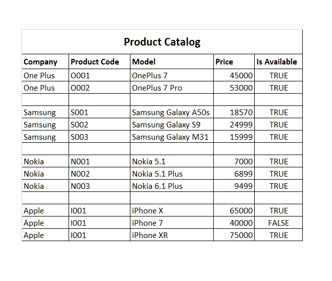

# Assignment-4 - Junior FSE MC1

## MC1: Developing EShop Application using Console Window (C# .Net Framework) 

***Concepts Covered***
1. Custom Generic types
2. Collection Classes
3. Sorting


## TestCase and Development Code

> - Follow the Test cases in `test` Project
> - Test cases are written for below provided data for ProductCatalog, hence accordingly create catalog object


> - Start writing your development code in `EShop.OrderService` Project

## Expected Outcome 

> - Check the expected outcome of test cases written in `test` Project to get the
    required result
> - Check the Below output as a reference to execute the test cases

```
Welcome to EShop... One Stop for Mobile Phones !!!

Menu

1. Company-wise Mobile Catalog
2. Place Order
3. List All Orders
4. List Pending Deliveries
5. Dispatch Orders
6. View Transaction Log
7. Exit

Enter Choice Input <1-7>: 1

Company : Apple
Product Code: I001 :: Model: iPhone X :: Price(Rs.): 65000 :: InStock: True
Product Code: I002 :: Model: iPhone XR :: Price(Rs.): 75000 :: InStock: False
Product Code: I003 :: Model: iPhone 7 :: Price(Rs.): 40000 :: InStock: True

Company : Nokia
Product Code: N001 :: Model: Nokia 5.1 :: Price(Rs.): 7000 :: InStock: True
Product Code: N002 :: Model: Nokia 5.1 Plus :: Price(Rs.): 6899 :: InStock: True
Product Code: N003 :: Model: Nokia 6.1 Plus :: Price(Rs.): 9499 :: InStock: False

Company : One Plus
Product Code: O001 :: Model: One Plus 7 :: Price(Rs.): 53000 :: InStock: False
Product Code: O002 :: Model: One Plus 7 Pro :: Price(Rs.): 45000 :: InStock: True

Company : Samsung
Product Code: S001 :: Model: Samsung Galaxy A50s :: Price(Rs.): 18570 :: InStock: False
Product Code: S002 :: Model: Samsung Galaxy S9 :: Price(Rs.): 24999 :: InStock: True
Product Code: S003 :: Model: Samsung Galaxy M31 :: Price(Rs.): 15999 :: InStock: False

Menu

1. Company-wise Mobile Catalog
2. Place Order
3. List All Orders
4. List Pending Deliveries
5. Dispatch Orders
6. View Transaction Log
7. Exit

Enter Choice Input <1-7>:

```
## Executable Console Application
> - Its `optional` once all the required test cases executed successfully 
    you can try with executable application i.e `EShop.APP`
    to get the output in a `console window`

#### To use this as a boilerplate for your new project, you can follow these steps

1. Clone the base boilerplate in the folder **EShopApplication_Assignment_4** of your local machine
     
    `git clone https://gitlab-cts.stackroute.in/groupname/EShopApplication_Assignment_4.git`
         
2. Navigate to assignment-solution folder

    `cd EShopApplication_Assignment_4`

3. Remove its remote or original reference

     `git remote rm origin`

4. Create a new repo in gitlab named `EShopApplication_Assignment_4` as private repo

5. Add your new repository reference as remote

     `git remote add origin https://gitlab-cts.stackroute.in/{{yourusername}}/EShopApplication_Assignment_4`

     **Note: {{yourusername}} should be replaced by your username from gitlab**

5. Check the status of your repo 
     
     `git status`

6. Use the following command to update the index using the current content found in the working tree, to prepare the content staged for the next commit.

     `git add .`
 
7. Commit and Push the project to git

     `git commit -a -m "Initial commit | or place your comments according to your need"`

     `git push -u origin master`

8. Check on the git repo online, if the files have been pushed

### Important instructions for Participants
> - We expect you to write the assignment on your own by following through the guidelines, learning plan, and the practice Assignments
> - The code must not be plagirized, the mentors will randomly pick the submissions and may ask you to explain the solution
> - The code must be properly indented, code structure maintained as per the boilerplate and properly commented
> - Follow through the problem statement shared with you

### MENTORS TO BEGIN REVIEW YOUR WORK ONLY AFTER ->
> - You add the respective Mentor as a Reporter/Master into your Assignment Repository
> - Intimate your Mentor on Slack with your Git URL - Once you done working and is ready for review.

	   
**Note : Once you have cloned boilerplate from the given gitlab URL, open the project in the Visual studio. 
Your project test cases might show compile time errors for methods, as you have not written the complete code.**

### Project structure

The folders and files you see in this repositories is how it is expected to be in projects, which are submitted for review

```
📦eshopapplication_assignment_4
 ┣ 📂EShop.APP
 ┃ ┣ 📂Properties
 ┃ ┃ ┗ 📜AssemblyInfo.cs
 ┃ ┣ 📜App.config
 ┃ ┣ 📜EShop.APP.csproj
 ┃ ┗ 📜Program.cs
 ┣ 📂EShop.OrderService
 ┃ ┣ 📂Models
 ┃ ┃ ┣ 📜Order.cs
 ┃ ┃ ┣ 📜Product.cs
 ┃ ┃ ┗ 📜ProductCatalog.cs
 ┃ ┣ 📂Properties
 ┃ ┃ ┗ 📜AssemblyInfo.cs
 ┃ ┣ 📂Services
 ┃ ┃ ┣ 📜OrderRepository.cs
 ┃ ┃ ┣ 📜ProductRepository.cs
 ┃ ┗ 📜EShop.OrderService.csproj
 ┣ 📂test
 ┃ ┣ 📂Properties
 ┃ ┃ ┗ 📜AssemblyInfo.cs
 ┃ ┣ 📜EShopTest.cs
 ┃ ┗ 📜test.csproj
 ┣ 📜.gitignore
 ┣ 📜catalog.png
 ┣ 📜EShopApplication_Assignment_5.sln
 ┣ 📜Problem.md
 ┗ 📜README.md

```
<b> `Don't change any file in test project` </b>